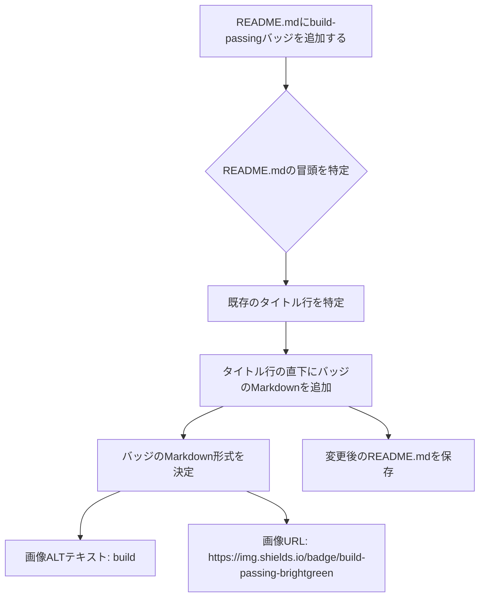

# 設計ドキュメント (Design Document)

## 1. 概要

### 1.1. プロジェクト名
[TEST-Bedrock-folder] READMEにbuild-passingバッジを追加する

### 1.2. プロジェクトID
TEST-Bedrock-folder-001

### 1.3. 作成日
2023-10-27

### 1.4. 最終更新日
2023-10-27

### 1.5. バージョン
v1.0.0

### 1.6. 目的
PRDで定義された要件に基づき、`README.md`にbuild-passingバッジを追加する実装の詳細を設計する。

## 2. システムアーキテクチャ

### 2.1. 既存アーキテクチャの概要
- GitHubリポジトリ `okamyuji/prd-design-implementation-agent` の`main`ブランチに存在する`README.md`ファイルを対象とする。
- `README.md`はMarkdown形式で記述されており、GitHub上でレンダリングされる。

### 2.2. 変更点
- `README.md`ファイルの内容のみを変更する。システムアーキテクチャ自体に変更はない。

## 3. コンポーネント設計

### 3.1. 影響を受けるコンポーネント
- `README.md`ファイル

### 3.2. 新規コンポーネント
- なし

### 3.3. コンポーネント間の相互作用
- なし

## 4. データ設計

### 4.1. 既存データモデル
- `README.md`はテキストファイルであり、特定のデータモデルは持たない。

### 4.2. 変更点
- `README.md`のテキストコンテンツに、バッジのMarkdown記法を追加する。

## 5. インターフェース設計

### 5.1. 外部インターフェース
- shields.io: バッジ画像を提供する外部サービス。静的なURLを使用するため、API連携は発生しない。

### 5.2. 内部インターフェース
- なし

## 6. ロジック設計

### 6.1. ロジックツリー


### 6.2. 詳細ロジック
1. `okamyuji/prd-design-implementation-agent`リポジトリをクローンまたはフォークする。
2. `main`ブランチから新しいフィーチャーブランチを作成する (例: `feature/add-build-badge-to-readme`)。
3. `README.md`ファイルを開く。
4. ファイルの冒頭、通常は`# プロジェクト名`のようなタイトル行の直下を特定する。
5. 以下のMarkdown形式のバッジコードを、特定した位置に挿入する。
   ```markdown
   
   ```
   **変更前**: 
   ```markdown
   # プロジェクト名
   
   プロジェクトの説明...
   ```
   **変更後**: 
   ```markdown
   # プロジェクト名
   
   
   
   プロジェクトの説明...
   ```
6. 変更を保存する。
7. ローカルで`README.md`をプレビューし、バッジが正しく表示されることを確認する。
8. 変更をコミットし、リモートリポジトリにプッシュする。
9. プルリクエストを作成する。

## 7. テスト設計

### 7.1. テスト戦略
- TDDの原則に従い、テスト観点を明確にした上で実装を進める。
- 本件はドキュメント変更のため、ユニットテストは不要。E2Eテストと手動目視確認が中心となる。

### 7.2. テストケース
- **正常系**: 
  - **TC-001**: `README.md`をローカルでプレビューした際、バッジがタイトル直下に表示され、画像が正しくレンダリングされること。
    - 期待結果: `build-passing`と表示された緑色のバッジが確認できる。
  - **TC-002**: GitHub上で`README.md`を表示した際、バッジがタイトル直下に表示され、画像が正しくレンダリングされること。
    - 期待結果: `build-passing`と表示された緑色のバッジが確認できる。
  - **TC-003**: バッジのALTテキストが「build」であること。
    - 期待結果: 画像が読み込めない場合に「build」と表示される。
  - **TC-004**: バッジのURLが`https://img.shields.io/badge/build-passing-brightgreen`であること。
    - 期待結果: バッジのリンク先が正しいURLである。
- **異常系**: 
  - **TC-005**: (該当なし。静的な画像URLのため、異常系は発生しにくい)
- **境界値**: 
  - **TC-006**: (該当なし)
- **エッジケース**: 
  - **TC-007**: (該当なし)
- **E2Eテスト**: 
  - **TC-008**: PRがマージされた後、`main`ブランチのGitHubリポジトリページで`README.md`が期待通りに表示され、バッジが正しく機能していることを確認する。
    - 期待結果: `main`ブランチの`README.md`にbuild-passingバッジが恒久的に表示されている。

### 7.3. 品質ゲート
- テストカバレッジ: 80%以上 (本件はコード変更がないため、既存カバレッジを維持し、ドキュメント変更に対するテスト観点が満たされていることを確認)
- Formatter: Prettier, Blackなどの設定に従い、コードがフォーマットされていること。
- Linter: ESLint, Pylintなどの設定に従い、警告・エラーがないこと。
- 静的解析: SonarQube, Banditなどの設定に従い、警告・エラーがないこと。
- テスト: 全てのテストがPassすること。
- ビルド: CI/CDパイプラインが正常に完了すること。

## 8. デプロイ計画

### 8.1. デプロイ手順
1. PRが承認され、`main`ブランチにマージされる。
2. GitHub Pagesなど、`README.md`を表示する環境があれば、自動的に更新が反映される。

### 8.2. ロールバック手順
1. 問題が発見された場合、該当コミットをリバートする。

## 9. 運用・保守

### 9.1. 監視項目
- `README.md`の表示が正常であること。
- shields.ioのサービスが正常に稼働していること (間接的な監視)。

### 9.2. メンテナンス計画
- バッジのURLが変更された場合、`README.md`を更新する。

## 10. 補足

### 10.1. 考慮事項
- 本PRは、CI/CDパイプラインの健全性確認と、Codex Cloudによる実装支援のテストを兼ねる。

### 10.2. 未決定事項
- なし


---

## Automation Metadata

- Requested at: 2026-05-03T01:11:45.618Z
- Target repository: okamyuji/prd-design-implementation-agent
- Base branch: main
- Working branch: codex/20260503T011145Z-test-bedrock-folder-readmebuild-passing


---

## Generated Artifacts

- PRD Google Doc: https://docs.google.com/document/d/1uyYmDHurLAlrXpYoXG0CF3Yw6Q5dL7qX0V2IxqBqg2U/edit
- DesignDoc Google Doc: https://docs.google.com/document/d/1p6d-tkgxxjDWNYLZoRgcxi6nNiiTkE48AkfTZUmIC-c/edit
