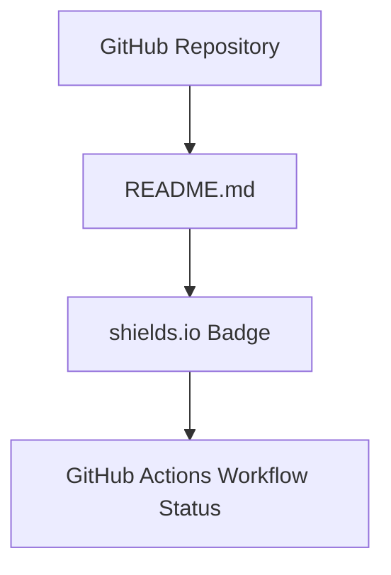

# 設計書 (Design Document)

## 1. 概要

### 1.1. プロジェクト名
READMEへのbuild-passingバッジ追加

### 1.2. 作成日
2023-10-27

### 1.3. 最終更新日
2023-10-27

### 1.4. 作成者
ソフトウェアアーキテクト

## 2. システムアーキテクチャ

### 2.1. 全体像
本変更は、`prd-design-implementation-agent` リポジトリの `README.md` ファイルを直接編集し、GitHub Actionsのビルドステータスを参照するshields.ioバッジのMarkdownリンクを追加する。既存のシステム構成への影響は最小限であり、主にドキュメントの更新となる。

### 2.2. コンポーネント図
- **GitHub Repository**: `okamyuji/prd-design-implementation-agent`
- **README.md**: リポジトリのルートにあるMarkdownファイル。このファイルが更新対象。
- **shields.io**: ビルドステータスを画像として提供する外部サービス。
- **GitHub Actions Workflow**: リポジトリのCI/CDワークフロー。ビルドステータスをshields.ioに提供する。

## 3. データ設計

### 3.1. データモデル
該当なし。データモデルの変更は発生しない。

### 3.2. スキーマ定義
該当なし。スキーマ定義の変更は発生しない。

## 4. 詳細設計

### 4.1. 機能設計

#### 4.1.1. README.mdへのバッジ追加
- **目的**: リポジトリのビルドステータスを視覚的に表示する。
- **ロジックツリー**:
    1. **README.mdの特定**: `okamyuji/prd-design-implementation-agent` リポジトリのルートにある `README.md` ファイルを特定する。
    2. **バッジURLの生成**: 
        - GitHub Actionsのワークフロー名（例: `CI`）を特定する。
        - リポジトリのオーナー名 (`okamyuji`) とリポジトリ名 (`prd-design-implementation-agent`) を特定する。
        - shields.ioのGitHub Actionsワークフローバッジ生成ルールに従い、URLを構築する。
            - フォーマット: `https://img.shields.io/github/actions/workflow/status/{owner}/{repo}/{workflow_file_name}/{branch}?branch={branch}&style=for-the-badge`
            - 例: `https://img.shields.io/github/actions/workflow/status/okamyuji/prd-design-implementation-agent/ci.yml?branch=main&style=for-the-badge`
    3. **Markdown形式の生成**: 
        - 生成したURLを元にMarkdownの画像リンク形式を構築する。
        - フォーマット: ``
        - GitHub ActionsワークフローURL: `https://github.com/{owner}/{repo}/actions/workflows/{workflow_file_name}`
        - 例: ``
    4. **README.mdへの挿入**: 
        - 生成したMarkdownを `README.md` の冒頭（既存のタイトル行の直下、またはファイルの最上部）に挿入する。
        - 既存のコンテンツとの競合がないことを確認する。

### 4.2. API設計
該当なし。APIの変更は発生しない。

### 4.3. データベース設計
該当なし。データベースの変更は発生しない。

## 5. テスト計画

### 5.1. テスト戦略
- **TDD (Test-Driven Development) の適用**: 本変更はドキュメントの更新であるため、厳密なTDDサイクルは適用しにくい。しかし、変更後のREADME.mdが期待通りに表示されることを確認するための「テスト」を事前に定義し、変更後に検証するアプローチを取る。
- **品質ゲート**: 
    - カバレッジ: 該当なし（コード変更ではないため）。
    - Formatter: `prettier` を使用し、Markdownファイルのフォーマットをチェックする。
    - Linter: `markdownlint` を使用し、Markdownの構文チェックを行う。
    - 静的解析: 該当なし。
    - テスト: 後述のテストケースをすべてPassすること。
    - ビルド: GitHub ActionsのCIワークフローが成功すること。

### 5.2. テストケース

#### 5.2.1. 正常系テスト
- **TC-001: バッジの表示確認**
    - **目的**: `README.md` の冒頭にbuild-passingバッジが正しく表示されることを確認する。
    - **手順**: 
        1. PRをマージ後、`main` ブランチの `README.md` をGitHub上で開く。
        2. ファイルの最上部にバッジが表示されていることを目視で確認する。
    - **期待結果**: 「build | passing」と表示されたshields.io形式のバッジが表示される。
- **TC-002: バッジリンクの確認**
    - **目的**: バッジをクリックした際に、GitHub Actionsのワークフローページに正しく遷移することを確認する。
    - **手順**: 
        1. `README.md` 上のバッジをクリックする。
    - **期待結果**: `https://github.com/okamyuji/prd-design-implementation-agent/actions/workflows/ci.yml` に遷移し、CIワークフローの実行履歴が表示される。

#### 5.2.2. 異常系テスト
- **TC-003: ビルド失敗時のバッジ表示**
    - **目的**: GitHub Actionsのビルドが失敗した場合に、バッジが「failing」と表示されることを確認する。
    - **手順**: 
        1. 一時的にCIワークフローを失敗させる変更を加え、PRを作成・マージする（本PRのスコープ外だが、将来的な検証として定義）。
        2. `main` ブランチの `README.md` をGitHub上で開く。
    - **期待結果**: 「build | failing」と表示されたshields.io形式のバッジが表示される。

#### 5.2.3. 境界値テスト
- 該当なし。

#### 5.2.4. エッジケーステスト
- **TC-004: ネットワークエラー時のバッジ表示**
    - **目的**: shields.ioサービスへのアクセスが一時的にできない場合に、READMEの表示に影響がないことを確認する。
    - **手順**: (手動での再現は困難なため、概念的なテスト)
        1. shields.ioがダウンしている状況を想定する。
        2. `README.md` を開く。
    - **期待結果**: バッジ画像は表示されないが、READMEの他のコンテンツは正常に表示される。

#### 5.2.5. E2Eテスト
- **TC-005: PRからマージまでのフロー**
    - **目的**: PR作成、レビュー、マージ、CI/CDの一連のフローが正常に機能し、最終的にREADMEが更新されることを確認する。
    - **手順**: 
        1. 本DesignDocに基づき実装を行う。
        2. PRを作成し、CIがPassすることを確認する。
        3. レビューを経てPRをマージする。
        4. `main` ブランチの `README.md` が更新され、バッジが正しく表示されていることを確認する。
    - **期待結果**: 全てのステップが成功し、最終的に `README.md` にbuild-passingバッジが追加される。

## 6. 運用・保守

### 6.1. 監視項目
- GitHub ActionsのCIワークフローの成功/失敗ステータス。
- README.mdの表示異常（バッジが表示されない、リンク切れなど）。

### 6.2. ログ設計
該当なし。

### 6.3. リリース計画
- 本PRを `main` ブランチにマージすることでリリースとする。

### 6.4. ロールバック計画
- 問題が発生した場合、該当PRをリバートすることで容易にロールバック可能。

## 7. 付録

### 7.1. 用語集
- **DesignDoc**: Design Document (設計書)
- **TDD**: Test-Driven Development (テスト駆動開発)
- **CI/CD**: Continuous Integration / Continuous Delivery (継続的インテグレーション / 継続的デリバリー)

### 7.2. 参考資料
- PRD: READMEへのbuild-passingバッジ追加 PRD

---

## Automation Metadata

- Requested at: 2026-05-03T01:23:44.721Z
- Target repository: okamyuji/prd-design-implementation-agent
- Base branch: main
- Working branch: codex/20260503T012344Z-test-html-readmebuild-passing

---

## Generated Artifacts

- PRD Google Doc: https://docs.google.com/document/d/1Zd4_4Aj45ks1G9Ub1AvpNN2X88eHFSH7HIxDvFIM2EI/edit
- DesignDoc Google Doc: https://docs.google.com/document/d/1GQuFMHdX1z8ILqarc_9B5tQEBfR5WwpcRIo31k8odaA/edit
