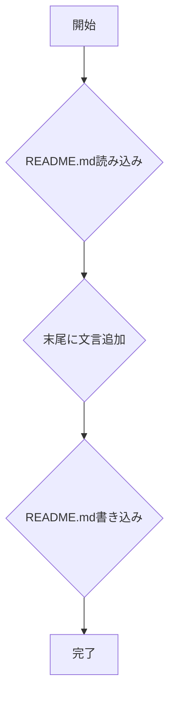

# 設計ドキュメント

## 1. 概要

### 1.1. プロジェクト名
test no-codex review v2

### 1.2. プロジェクトID
DD-20240729-001

### 1.3. 作成日
2024-07-29

### 1.4. 最終更新日
2024-07-29

### 1.5. 作成者
自動生成エージェント

## 2. システムアーキテクチャ

### 2.1. 全体像
本タスクは、特定のGitHubリポジトリ内の単一ファイル(`README.md`)を更新するシンプルなファイル操作です。外部サービスとの連携は発生せず、ローカルファイルシステム上での読み書き操作が中心となります。



### 2.2. コンポーネント詳細
- **ファイル読み込みモジュール**: 指定されたパスの`README.md`ファイルを読み込み、その内容を文字列として返す。
- **文字列操作モジュール**: 読み込んだ文字列の末尾に指定された文言を追加する。
- **ファイル書き込みモジュール**: 更新された文字列を`README.md`ファイルに上書き保存する。

## 3. データ設計

### 3.1. データモデル
- **README.mdの内容**: 文字列型。ファイル全体の内容を保持。
- **追加文言**: 文字列型。「このリポジトリの自動レビューはCodeRabbitとGemini Code Assistで適応します。」

## 4. ロジック設計

### 4.1. 主要ロジック

```mermaid
flowchart TD
    start((開始)) --> read_file[README.mdを読み込む];
    read_file -- 成功 --> check_content{ファイル内容が空か？};
    check_content -- はい --> append_text_empty[指定文言をそのまま追加];
    check_content -- いいえ --> append_text_newline[改行を追加し、指定文言を追加];
    append_text_empty --> write_file[更新内容をREADME.mdに書き込む];
    append_text_newline --> write_file;
    write_file -- 成功 --> end((完了));
    read_file -- 失敗 --> error_read[エラー: ファイル読み込み失敗];
    write_file -- 失敗 --> error_write[エラー: ファイル書き込み失敗];
    error_read --> fail((失敗));
    error_write --> fail((失敗));
```

### 4.2. ロジックツリー

- **README.md更新処理**
    - **ファイル読み込み**
        - ターゲットリポジトリの`README.md`パスを特定
        - ファイルを読み込む
            - 成功: ファイル内容を文字列として取得
            - 失敗: エラーハンドリング（ファイルが存在しない、読み込み権限がないなど）
    - **内容追加**
        - 取得したファイル内容が空か判定
            - 空の場合: 追加文言をそのまま連結
            - 空でない場合: 既存内容の末尾に改行コード (`\n`) を追加し、その後に指定文言を連結
                - 指定文言: 「このリポジトリの自動レビューはCodeRabbitとGemini Code Assistで適応します。」
    - **ファイル書き込み**
        - 更新された内容を`README.md`に上書き保存
            - 成功: 処理完了
            - 失敗: エラーハンドリング（書き込み権限がない、ディスク容量不足など）

## 5. テスト計画

### 5.1. テスト戦略
- **TDD (Test-Driven Development)**: 最初にテストケースを記述し、そのテストがパスするように実装を進めます。
- **カバレッジ**: コードカバレッジ80%以上を品質ゲートとします。
- **テストの種類**: ユニットテスト、結合テスト、E2Eテストを実施します。

### 5.2. テストケース
#### 5.2.1. ユニットテスト
- **対象**: ファイル読み込み、文字列操作、ファイル書き込みの各モジュール
- **観点**: 
    - **正常系**: 
        - 既存の`README.md`ファイルが存在し、内容が正しく読み込まれること。
        - 既存の`README.md`ファイルが空の場合、指定文言が正しく追記されること。
        - 既存の`README.md`ファイルに内容がある場合、改行後に指定文言が正しく追記されること。
        - 更新された内容が`README.md`ファイルに正しく書き込まれること。
    - **異常系**: 
        - `README.md`ファイルが存在しない場合に、適切なエラーが返されること。
        - `README.md`ファイルへの読み込み権限がない場合に、適切なエラーが返されること。
        - `README.md`ファイルへの書き込み権限がない場合に、適切なエラーが返されること。
        - ディスク容量が不足している場合に、適切なエラーが返されること。
    - **境界値**: 
        - `README.md`ファイルが1バイトのみの内容の場合。
        - `README.md`ファイルが非常に大きい場合（例: 1MB）。
    - **エッジケース**: 
        - `README.md`ファイルの末尾に既に改行がある場合。
        - `README.md`ファイルの末尾に既に指定文言と類似の文字列がある場合（ただし、今回は完全一致のみを対象とするため、このケースは無視可能）。

#### 5.2.2. 結合テスト
- **対象**: ファイル読み込み -> 文字列操作 -> ファイル書き込みの一連のフロー
- **観点**: 
    - **正常系**: 
        - `README.md`の読み込み、追記、書き込みの一連の処理が問題なく完了し、最終的なファイル内容が期待通りであること。
    - **異常系**: 
        - フローの途中でエラーが発生した場合（例: 読み込み成功、書き込み失敗）に、適切にエラーハンドリングされ、システムが異常終了しないこと。

#### 5.2.3. E2Eテスト
- **対象**: 実際のファイルシステム上での操作
- **観点**: 
    - **正常系**: 
        - 実際の`okamyuji/prd-design-implementation-agent`リポジトリのクローンを作成し、`main`ブランチの`README.md`に対して更新処理を実行後、`README.md`の末尾に指定文言が追記されていることを確認する。
        - `README.md`以外のファイルに変更がないことを確認する。
    - **異常系**: 
        - 存在しないリポジトリパスを指定した場合に、適切なエラーメッセージが表示されること。
        - 読み取り専用のファイルシステムに対して書き込みを試みた場合に、適切なエラーメッセージが表示されること。

## 6. 品質ゲート

- **コードフォーマット**: Prettier, BlackなどのFormatterを適用し、すべてのファイルがフォーマットルールに準拠していること。
- **Linter**: ESLint, PylintなどのLinterを適用し、すべての警告・エラーが解消されていること。
- **静的解析**: SonarQube, Banditなどの静的解析ツールを適用し、検出された脆弱性やバグが修正されていること。
- **テスト**: すべてのユニットテスト、結合テスト、E2Eテストがパスすること。
- **カバレッジ**: コードカバレッジが80%以上であること。
- **ビルド**: プロジェクトがエラーなくビルドできること。

## 7. デプロイ計画

- 本タスクはGitHub ActionsなどのCI/CDパイプラインを通じて自動デプロイされることを想定します。
- `main`ブランチへのマージをトリガーとして、変更が適用されます。

## 8. ロールバック計画

- GitHubの履歴機能を利用して、問題発生時には以前のコミットにロールバックします。
- `git revert <commit_hash>`コマンドを使用します。


---

## Automation Metadata

- Requested at: 2026-05-03T02:48:54.387Z
- Target repository: okamyuji/prd-design-implementation-agent
- Base branch: main
- Working branch: agent/20260503T024854Z-test-no-codex-review-v2


---

## Generated Artifacts

- PRD Google Doc: https://docs.google.com/document/d/1XbNUD4zlRH3RSmdL_MOl-uxZEPAR-RFsvQyO7LywQCY/edit
- DesignDoc Google Doc: https://docs.google.com/document/d/1AzK395FW35wEJDqvYdcYLcbvcs7ZAQBqlqeVZsGe2_Q/edit
