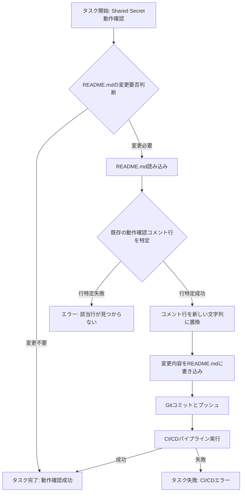

# 設計ドキュメント (Design Doc)

## 1. 概要

本設計ドキュメントは、`okamyuji/prd-design-implementation-agent`リポジトリにおけるShared Secretの動作確認タスクの実装詳細を記述します。README.mdファイルの動作確認コメント行を更新することで、Shared Secret経由でのCI/CD動作確認を行います。

## 2. 目的

- PRDで定義された要件に基づき、README.mdの動作確認コメントを更新する具体的な手順を定義する。
- 最小限の変更で、CI/CDパイプラインの健全性を検証するための実装計画を策定する。

## 3. スコープ

### 3.1. 含まれる範囲

- README.mdファイルの特定の行の文字列置換。
- GitHub ActionsのCI/CDパイプラインが正常に動作することの確認。

### 3.2. 含まれない範囲

- README.md以外のファイルへの変更。
- CI/CDパイプラインの定義ファイル（`.github/workflows/*`）への変更。

## 4. システムアーキテクチャ

既存のシステムアーキテクチャに変更はありません。本タスクは、既存のCI/CDパイプラインを活用し、Shared Secretが正しく機能していることを確認するためのものです。

## 5. 詳細設計

### 5.1. ロジックツリー

### 5.2. 実装手順

1.  **README.mdの特定**: リポジトリのルートにある`README.md`ファイルを特定する。
2.  **既存行の検索**: `README.md`ファイルの内容を読み込み、以下の正規表現パターンに合致する行を検索する。
    -   `^最終動作確認: \d{4}-\d{2}-\d{2} \(.*?\)$`
    -   このパターンは「最終動作確認: YYYY-MM-DD (任意のコメント)」という形式の行を捕捉する。
3.  **文字列の置換**: 検索した行を以下の新しい文字列に置き換える。
    -   `最終動作確認: 2026-05-03 (Verify Shared Secret 経由)`
4.  **ファイルの書き込み**: 変更後の内容で`README.md`ファイルを上書き保存する。
5.  **Git操作**: 変更をコミットし、リモートリポジトリにプッシュする。
    -   コミットメッセージは「feat: Update README.md for Shared Secret verification」など、意図が明確なものとする。

### 5.3. データ構造

- 変更なし。

### 5.4. API設計

- 変更なし。

## 6. テスト計画

本タスクはREADME.mdの変更のみであり、コードロジックの追加・変更がないため、ユニットテストや結合テストの新規作成は不要です。既存のCI/CDパイプラインが本変更を検知し、正常に完了することをもってテストとします。

### 6.1. TDD (Test-Driven Development) の進め方

本タスクはコード変更を伴わないため、厳密なTDDサイクルは適用しません。しかし、以下の観点で「テストファースト」の考え方を適用します。

1.  **期待される結果の定義**: README.mdが正しく更新され、CI/CDが成功するという「テスト」を最初に定義します。
2.  **最小限の実装**: 上記の期待される結果を達成するための最小限の変更（README.mdの更新）を行います。
3.  **テストの実行**: PRをオープンし、CI/CDパイプラインを実行することで、定義した「テスト」がパスするかを確認します。

### 6.2. テスト観点

- **正常系**: README.mdの既存の動作確認コメント行が、指定された新しい文字列に正確に置き換えられ、CI/CDパイプラインが正常に完了すること。
- **異常系**: (本タスクでは想定しないが、例えば) README.mdファイルが存在しない、または書き込み権限がない場合に適切なエラーハンドリングが行われること。
- **境界値**: README.mdのコメント行がファイルの先頭や末尾にある場合でも正しく置換されること。
- **エッジケース**: 動作確認コメント行が複数存在する場合（本タスクでは1行のみを想定）。
- **E2E (End-to-End)**: PR作成からCI/CDパイプラインの実行、マージ、そして`main`ブランチのREADME.mdが最終的に更新されるまでの一連の流れが正常に完了すること。

### 6.3. 品質ゲート

以下の条件をすべて満たすことを品質ゲートとします。

- **Formatter**: PrettierなどのFormatterが適用され、コードスタイルが統一されていること（README.mdのMarkdownフォーマットを含む）。
- **Linter**: ESLintなどのLinterが警告・エラーなしでパスすること（本タスクではJS/TSコード変更がないため、既存のLinter設定に影響なし）。
- **静的解析**: SonarQubeなどの静的解析ツールが設定された品質プロファイルをパスすること。
- **テスト**: 既存のユニットテスト、結合テストがすべてパスし、テストカバレッジが80%以上を維持すること。
- **ビルド**: プロジェクトがエラーなくビルドできること。
- **CI/CD**: GitHub Actionsのすべてのワークフローが成功すること。

## 7. 運用・監視

- CI/CDパイプラインの実行結果をGitHub ActionsのUIで監視します。
- 異常が発生した場合は、GitHub Actionsのログを確認し、原因を特定します。

## 8. セキュリティ

- Shared SecretはGitHubのSecrets機能で管理されており、コード内に直接記述することはありません。
- PRDのNFR-2に従い、Shared Secretの漏洩がないことを確認します。

## 9. 考慮事項

- `README.md`の既存の動作確認コメント行のフォーマットが、想定と異なる場合、置換が失敗する可能性がある。その場合は、手動での調整が必要となる。
- 最小差分での変更を厳守し、`README.md`以外のファイルには一切変更を加えない。

## 10. 変更履歴

- 2024-07-20: 初版作成

---

## Automation Metadata

- Requested at: 2026-05-03T11:31:41.664Z
- Target repository: okamyuji/prd-design-implementation-agent
- Base branch: main
- Working branch: agent/20260503T113141Z-verify-shared-secret

---

## Generated Artifacts

- PRD Google Doc: https://docs.google.com/document/d/1UgMiZgZJRj3QD8P8klHgdEmaWAKTlb7w37bjPFez2zM/edit
- DesignDoc Google Doc: https://docs.google.com/document/d/1iQC20joiyNSEJg9HzTd_No2dXoQhXqw86v8oHZxW5Kc/edit
