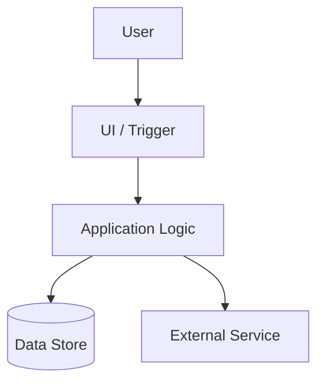
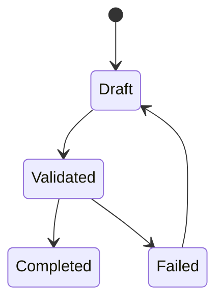

# DesignDocテンプレート

> このテンプレートは、GitLab/Jujutsu/IEEE系SDD/一般的なDesign Docの公開テンプレートを、日本語の機械的実装委任に向くように再構成したものです。DesignDocは「どう作るか」を、実装者が迷わず作業できる粒度まで落とします。

## 1. メタ情報

| 項目 | 内容 |
| --- | --- |
| タイトル |  |
| 対応PRD |  |
| 作成日 |  |
| 作成者 |  |
| ステータス | Draft / Review / Approved / Implementing / Done |
| 対象リポジトリ |  |
| 対象ブランチ |  |

## 2. 要約

3〜10文で、何を解決し、どのような方式で実装し、完了時に何が変わるかを説明する。

## 3. 背景と問題設定

- 現状:
- 問題:
- なぜ既存方式では不十分か:
- 関連PRD要求ID:

## 4. ゴール / 非ゴール

### 4.1 ゴール

- G-001:
- G-002:
- G-003:

### 4.2 非ゴール

- NG-001:
- NG-002:
- NG-003:

## 5. MECEロジックツリー

```text
目的
├── ユーザー価値
│   ├── 主要ユースケースA
│   └── 主要ユースケースB
├── システム変更
│   ├── UI/入力
│   ├── API/ドメインロジック
│   ├── データ永続化
│   └── 外部連携
├── 品質
│   ├── 正常系
│   ├── 異常系
│   ├── 境界値
│   └── エッジケース
└── 運用
    ├── ログ/監査
    ├── ロールバック
    └── 監視
```

## 6. 現状調査

| 対象 | ファイル/コンポーネント | 現状 | 変更要否 |
| --- | --- | --- | --- |
|  |  |  |  |

## 7. 提案設計

### 7.1 全体アーキテクチャ

- 主要コンポーネント:
- データフロー:
- 責務分担:



### 7.2 コンポーネント設計

| コンポーネント | 責務 | 入力 | 出力 | 依存 |
| --- | --- | --- | --- | --- |
|  |  |  |  |  |

### 7.3 API / インターフェース

| API/関数 | 入力 | 出力 | エラー | 備考 |
| --- | --- | --- | --- | --- |
|  |  |  |  |  |

### 7.4 データ設計

| エンティティ | フィールド | 型 | 制約 | 備考 |
| --- | --- | --- | --- | --- |
|  |  |  |  |  |

### 7.5 状態遷移



### 7.6 エラー処理

| エラー | 検知箇所 | ユーザー影響 | リカバリ | テスト |
| --- | --- | --- | --- | --- |
|  |  |  |  |  |

### 7.7 セキュリティ / 権限 / 監査

- 認証:
- 認可:
- 秘密情報:
- 監査ログ:
- 外部送信データ:

## 8. 代替案と採用理由

| 案 | メリット | デメリット | 採否 | 理由 |
| --- | --- | --- | --- | --- |
| A |  |  | 採用/不採用 |  |

## 9. 実装分解

| Step | 作業 | 対象ファイル | 完了条件 |
| --- | --- | --- | --- |
| 1 | 失敗するテストを追加 |  | テストが期待通り失敗する |
| 2 | 最小実装 |  | 対象テストが通る |
| 3 | 異常系/境界値/エッジケースを追加 |  | テスト網羅が増える |
| 4 | リファクタリング |  | 振る舞いを変えず重複を削減 |
| 5 | E2E追加 |  | 主要ユーザーフローが通る |
| 6 | 品質ゲート |  | Formatter/Linter/静的解析/Test/Buildが全通過 |

## 10. TDD / テスト戦略

### 10.1 カバレッジ目標

- 最低ライン: 80%以上
- 重要ドメインロジック: 90%以上を目標
- カバレッジを上げるためだけの無意味なテストは禁止

### 10.2 テスト観点

| 種別 | 観点 | 具体例 |
| --- | --- | --- |
| 正常系 | 期待される主要フロー |  |
| 異常系 | 入力不正、外部API失敗、権限不足 |  |
| 境界値 | 空、最小、最大、閾値前後 |  |
| エッジケース | 同時実行、重複、タイムアウト、部分失敗 |  |
| 回帰 | 既存仕様の破壊防止 |  |
| E2E | 実ユーザーの主要操作 |  |

### 10.3 品質ゲート

言語/フレームワークに応じて以下を特定し、すべて通過させる。

- Formatter
- Linter
- 静的解析 / Typecheck
- Unit tests
- Integration tests
- E2E tests
- Coverage >= 80%
- Build

## 11. ロールバック / 運用

- ロールバック方法:
- データ移行の戻し方:
- 監視項目:
- リリース後確認:

## 12. Codex Cloud実装依頼テンプレート

```text
@codex このPRのDesignDocに従って実装してください。

完了条件:
- DesignDocの実装分解を順に実施する
- TDDで進める
- 正常系、異常系、境界値、エッジケースを含む本質的なテストを追加する
- Unit/E2Eともに主要フローを網羅する
- カバレッジ80%以上を満たす
- Formatter、Linter、静的解析、テスト、ビルドをすべてPassさせる
- 失敗する品質ゲートがあれば修正してから完了報告する
- 変更内容、テスト結果、残リスクをPRコメントにまとめる
```

## 参考にした公開情報

- GitLab Design Documents template: https://handbook.gitlab.com/handbook/engineering/architecture/design-documents/_template
- Jujutsu Design doc blueprint: https://docs.jj-vcs.dev/latest/design_doc_blueprint/
- Markdown Software Design Description: https://github.com/jam01/SDD-Template
- DesignDocs.dev: https://www.designdocs.dev/
